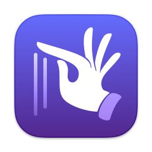
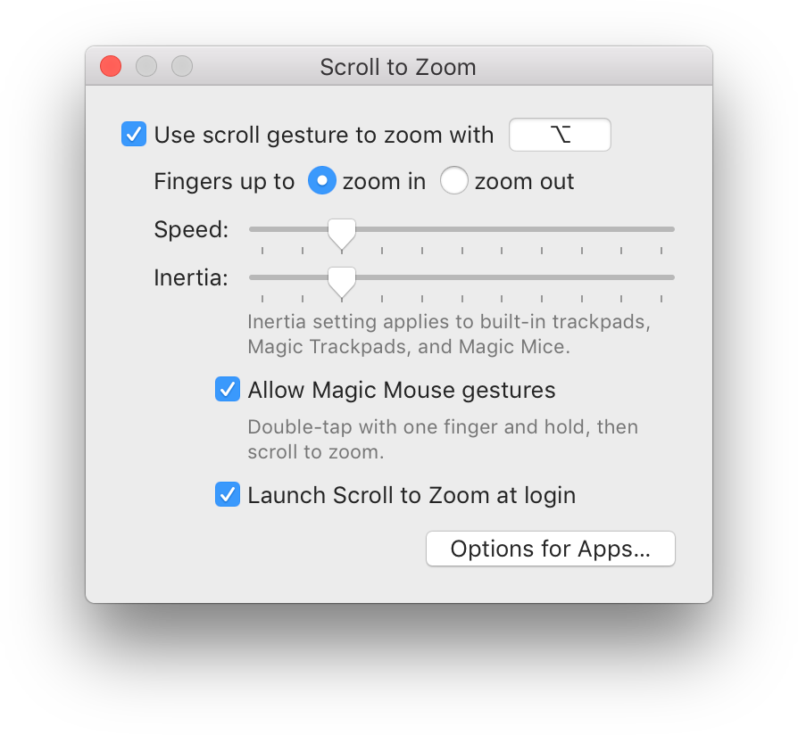

<small>**English (US)**・[简体中文（大陆）](README.zh_CN.md)</small>

#  Scroll to Zoom

A Mac utility for precisely zooming in or out using the mouse wheel.

## Features

- Hold modifier keys or an auxiliary mouse button to zoom.
- Customizable direction, speed, and per-application configuration.
- Compatible with other mouse optimization tools.

**Bonus for Magic Mouse users**: You can double tap and scroll, that is, finder down—up—down—moves, to zoom in and out, just like how you zoom the Apple Maps on the iPhone. This works naturally if you also enable double-tap to smart zoom.

## Overview

With the specified modifier keys held or an auxiliary mouse button pressed, you can perform precise zooming in any app with your mouse wheel. Scroll to Zoom converts mouse wheel events into simulated zoom gestures. The app is lightweight (~1 MB) and runs efficiently in the background.

Scroll to Zoom works seamlessly with other tools like [Mos](https://github.com/Caldis/Mos), [LinearMouse](https://github.com/linearmouse/linearmouse), or others you love. If that tool provides a smooth scrolling experience, Scroll to Zoom will benefit from it, giving a smooth zooming experience.

Regardless of how these tools configure the direction of scrolling, the zooming is always based on your fingers moves. You can configure whether “fingers up” means zooming in or out in the app.

You can control for what app Scroll to Zoom should be enabled. Additionally, if modifier keys break the normal zooming behavior, you can choose to remove them from the simulated events for that specific app. For example, Firefox won’t zoom with any modifier key down, so you can enable “Erase Modifier Keys” for it in the settings.

## Installation

You’ll need:
- An Intel or Apple Silicon Mac,
- macOS 10.13 High Sierra or later, and
- A pointing device that supports scrolling.

Download the [latest release](https://github.com/alphaArgon/ScrollToZoom/releases) and move the unarchived content into the Applications folder. Open the app and click on the checkbox. You need to grant permission by following the instructions on the popover on the first launch.

Because this app uses some protected technologies, it cannot be sandboxed and distributed on the Mac App Store.

## Localization

English (US), Simplified Chinese (Mainland), and Traditional Chinese (Taiwan) are supported. Contributions to localization are welcome.

## Technologies

The core functionality is written in C for zero-cost abstraction. Since this app supports down to High Sierra, where Swift ABI is not stable and an external runtime library is required, the app is written in Objective-C.

This app has a built-in logging panel. Open the settings window while holding the Option key (⌥). A ladybug button will appear in the bottom-left corner. Clicking it opens the logging panel. For performance reasons, logging is enabled only if the panel is shown, and the panel records up to a thousand recent logs.

## Known Issues

- Mozilla Firefox: Described in Overview.
- Google Chrome: Zoom events only take effect after the accumulated scale exceeds a certain threshold. This is a design decision of Chrome.
- Sketch: Zoom events with small scale are ignored. This is a design decision of Sketch.

You are welcome to report issues and contribute to this project.

## License

The source code of Scroll to Zoom is released under the MIT license. See [LICENSE](LICENSE) for details. The app icon and status bar image are created from a glyph of the font *Zapfino* shipped with macOS, which may have a different license. Other assets are copyrighted by the owner of this repository.
