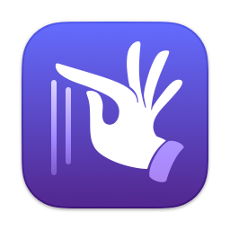

<small>[English (US)](README.md)・**简体中文（大陆）**</small>

#  滚动来缩放

让鼠标滚轮可以精准缩放的 Mac 小工具。

## 功能

- 按下修饰键或者鼠标侧边键来缩放
- 自定义方向、速度、各 app 单独的配置
- 兼容其他鼠标优化工具

###  妙控鼠标特供

轻点两下然后滚动（手指触碰—抬起—触碰—移动）来放大和缩小。这个交互方式和在 iPhone 上缩放 Apple 地图是一样的。如果同时启用了轻点两下来智能缩放，这个操作会很自然。

如果你只需要这个功能，并且没有安装其他鼠标优化 app，可以自行编译本 repo 下的 MagicZoom.xcodeproj。独立的 app 在性能上有一定提升。

## 简介

当按住设置的修饰键，或按下鼠标侧边键（或中键）时，可以在任何 app 中用鼠标滚轮来精准缩放。「滚动来缩放」在后台运行，将滚轮事件模拟为缩放手势。体积轻巧（约 1 MB），性能高效。


「滚动来缩放」可以与 [Mos](https://github.com/Caldis/Mos)、[LinearMouse](https://github.com/linearmouse/linearmouse) 或其他你想用的工具无缝配合使用。如果这些工具提供了滚动平滑支持，「滚动来缩放」也能从中揩油，提供平滑的缩放。

无论这些工具怎么设置滚动方向，缩放方向总是基于手指移动的。你可以在应用中设置「手指向上滑」来放大还是缩小。

支持控制在哪些 app 中启用「滚动来缩放」。如果修饰键破坏了正常的缩放行为，可以选择对某 app 移除模拟滚动事件中的修饰键标记。比如按下修饰键时，Firefox 总是不缩放，因此可以在设置中对它启用「擦除修饰键」。

## 安装

需要：
- Intel 或 Apple Silicon 的 Mac
- macOS 10.13 High Sierra 或更高版本
- 支持滚动的可点击设备

下载 [latest release](https://github.com/alphaArgon/ScrollToZoom/releases)，然后将解压的内容移动到「应用程序」文件夹。在 macOS Sequoia 或更高系统中，需要在终端中运行下列命令来绕过 Gatekeeper（如果你确实信任此 app）：

```sh
xattr -dr com.apple.quarantine /Applications/Scroll\ to\ Zoom.app
```

确保路径名 (/Applications/Scroll to Zoom.app) 符合 app 的实际位置，且空格被正确转义。对于首次启动，请右键点击 app，从上下文菜单中选择「打开」，并按照提示授予必要的权限。

由于此 app 使用了一些受保护的技术，它不能运行在 App Sandbox 里，也不能上架 Mac App Store。

## 本地化

支持英语（美国）、简体中文（大陆）和繁体中文（台湾）。欢迎为本地化提供帮助。

## 技术使用

为了零成本抽象，核心功能由 C 编写。由于要支持到 High Sierra，而 Swift ABI 在该版本上不稳定，需要额外的运行时库，所以 app 使用 Objective-C 编写。

另外内置了日志面板。按住 Option 键（⌥）打开设置窗口时，左下角会出现一个瓢虫按钮。点击它会打开日志面板。出于性能考虑，仅当面板显示时，才会记录最近一千条日志。

## 已知问题

- Mozilla Firefox：同「简介」中所述。
- Google Chrome：仅当累加缩放量超过某个阈值时，缩放事件才会生效。这是 Chrome 的设计决定。
- Sketch：单次缩放量的缩放事件会被忽略。这是 Sketch 的设计决定。

欢迎提交 issue 来改进这个项目。

## 许可

「滚动来缩放」的源代码在 MIT 许可证下发布，详情见 [LICENSE](LICENSE)。App 图标和状态栏图像是基于 macOS 附带的字体 *Zapfino* 中的一个字形创建的，可能具有不同的许可。其他资源的版权归本 repository 持有者所有。
